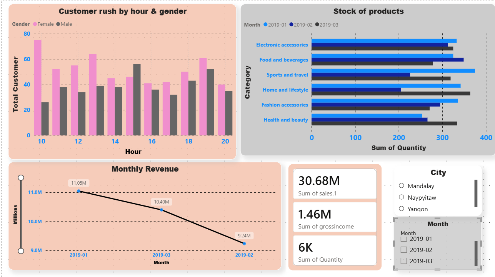

# retail-sales-analysis
PROJECTS

Retail Sales Analysis | SQL · Python · Power BI · Excel
- Analysed 1,000+ supermarket transactions across 3 cities
  using SQL queries and Python (pandas) for data cleaning
- Built an interactive Power BI dashboard with 5 business
  visuals and dynamic slicers for city and month filtering
- Key finding: Food & Beverages drove highest profit;
  peak customer hour identified as 7 PM
- GitHub: github.com/yourusername/retail-sales-analysis
  

